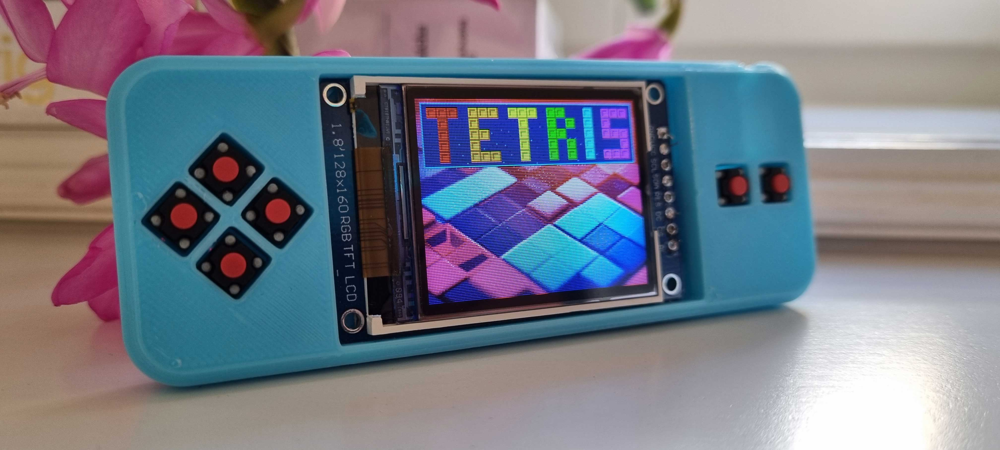

# ChipChamp
This is the GitHub repository containing source code, schematic and 3D models for ChipChamp: https://vonkonow.com/wordpress/ChipChamp/

ChipChamp is an open-source gaming platform built to increase the understanding of how hardware and software really works.
It is designed to be **beginner friendly**, **affordable**, and **playful**.

ChipChamp appears as a USB drive when connected to a computer and games can be programmed directly in CircuitPython with a text editor.  I have made a package of basic games as inspiration and starting point for you to create new ones.

> In many ways ChipChamp is a retro dream console like the Pico-8, only in physical form ;)

There are similar projects available, here are some advantages with ChipChamp:
-	Easy to build and understand.
-	Very affordable, open source, no custom PCB and using components that are easy to order.
-	Beginner friendly to program (write CircuitPython code directly on the USB drive).
-	Polyphonic audio (instead of a beeper).
-	Built in internet connection and multiplayer support over Wi-Fi.
-	Quite powerful, it should be able to run Nintendo emulators and even DOOM (remains to be seen).

## Specification
-	Processor: ESP32-S2 processor with USB-OTG, 4MB Flash and 2MB PSRAM. 
-	Display: 160x128 pixel TFT with 65536 colors (ST7735 driver).
-	Control: D PAD and A, B keys for input, using quiet switches with low activation force.
-	Audio: 3.5mm audio socket connected to 4 channel PWM or 8-bit DAC. (not yet supported in CircuitPython)
-	Possibility to add Li-ion battery and charger to make it fully portable.

You can build your own ChipChamp with a 3D printer, soldering iron and a handful of components. Everything is open source and hacking is encouraged!

Check out the forum to get support and contribute: https://vonkonow.com/wordpress/community/

For detailed building instructions visit: https://vonkonow.com/wordpress/ChipChamp/
